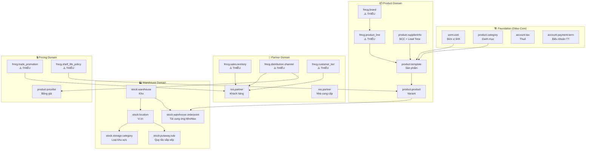

# 📦 Phân tích Master Data cho FMCG Inventory Simulation
> **Phạm vi:** Tập đoàn FMCG giả lập, tập trung nghiệp vụ Inventory  
> **Nền tảng:** Odoo 18 (source tại `/home/tam1/Projects/FMCG_DataPlatform/odoo`)

---

## PHẦN 1 — ĐỘ ĐA DẠNG MASTER DATA CẦN CÓ

Để giả lập một tập đoàn FMCG thực tế, master data cần được thiết kế đủ độ **phức tạp theo chiều rộng** (nhiều loại) và **chiều sâu** (nhiều bản ghi), bao phủ đủ các scenario nghiệp vụ Inventory.

---

### 🏭 NHÓM 1 — Tổ chức (Organization)

| Thực thể | Mức độ đa dạng khuyến nghị | Mục đích |
|---|---|---|
| **Company (Công ty)** | 1 Holding + 3-5 Công ty con | Multi-company, inter-company transfer |
| **Warehouse (Kho)** | 1 CDC trung tâm + 3 Kho vùng (Bắc/Trung/Nam) | Test internal transfer, replenishment |
| **Location (Vị trí kho)** | Mỗi kho: 1 Input + 1 QC + 3-5 Storage Zone + 1 Output + 1 Scrap | Test routing 3-step, putaway rules |
| **Storage Category** | Ambient, Chilled, Frozen, Hazardous | Putaway Strategy theo nhiệt độ |
| **Users & Roles** | Warehouse Manager, Stock User, Accountant, Salesperson | Multi-role workflow simulation |

> [!NOTE]  
> Đối với FMCG, thường có **3-bước kho** (3 steps): Input → Quality Check → Storage → Pick → Pack → Delivery. Cần đủ Location để test đầy đủ.

---

### 📦 NHÓM 2 — Sản phẩm (Product Master Data)

Đây là nhóm **phức tạp nhất** và cần đa dạng nhất:

#### 2.1 — Danh mục sản phẩm (Product Categories)
```
Tất cả sản phẩm (All Products)
├── Thành phẩm (Finished Goods)
│   ├── Đồ uống (Beverages)
│   │   ├── Nước có gas (Carbonated)
│   │   └── Nước không gas (Still Water / Juice)
│   ├── Thực phẩm khô (Dry Food)
│   │   ├── Mì / Cháo ăn liền
│   │   └── Gia vị / Sốt
│   └── Hóa mỹ phẩm (FMCG Non-Food)
│       ├── Chăm sóc cá nhân
│       └── Tẩy rửa gia dụng
├── Nguyên vật liệu (Raw Materials)
│   ├── Thành phần thực phẩm
│   └── Hóa chất
└── Bao bì (Packaging)
    ├── Bao bì sơ cấp (Chai, Hộp, Gói)
    └── Bao bì thứ cấp (Thùng carton, Pallet)
```

**Mức độ đa dạng:** Tối thiểu **3-4 cấp danh mục**, ~15-20 leaf categories.

#### 2.2 — Đơn vị tính đa cấp (UoM Hierarchy) — **Đặc trưng FMCG**

| Cấp | Tên | Ví dụ |
|---|---|---|
| UoM cơ bản | `Đơn vị (Unit/Cái/Chai)` | 1 Chai |
| UoM đóng gói 1 | `Lốc` | 1 Lốc = 6 Chai |
| UoM đóng gói 2 | `Thùng` | 1 Thùng = 24 Chai (4 Lốc) |
| UoM đóng gói 3 | `Pallet` | 1 Pallet = 40 Thùng = 960 Chai |
| UoM khối lượng | `kg`, `g` | Cho NVL |
| UoM thể tích | `Lít`, `ml` | Cho chất lỏng |

> [!IMPORTANT]  
> FMCG yêu cầu **UoM Category riêng cho từng dòng sản phẩm**. Mỗi dòng sản phẩm có tỷ lệ quy đổi khác nhau (Lốc nước = 6 chai, Lốc mì = 12 gói).

#### 2.3 — Product Template & Variants (Sản phẩm)

| Loại sản phẩm | Số lượng | Đặc điểm cấu hình |
|---|---|---|
| **Thành phẩm có Variant** | 5-8 template × 3-5 variants | Tracking = Lot + Expiry Date |
| **Thành phẩm đơn giản** | 10-15 | Tracking = Lot |
| **Nguyên vật liệu** | 5-10 | Cannot be Sold = True |
| **Bao bì** | 5-8 | Storable, không theo dõi Lot |
| **Dịch vụ** | 2-3 | Transport, Handling Fee |

**Product Attributes (cho Variants):**
- `Hương vị (Flavor)`: Cam, Dứa, Dâu, Chanh Muối
- `Dung tích (Volume)`: 330ml, 500ml, 1L, 1.5L  
- `Loại bao bì (Pack Type)`: Lon, Chai nhựa, Chai thủy tinh

#### 2.4 — Cấu hình Inventory trên Product

| Tham số | Thành phẩm FG | NVL | Bao bì |
|---|---|---|---|
| `Product Type` | Storable | Storable | Storable |
| `Tracking` | By Lot / By SN | By Lot | None |
| `Expiration Time` | ✅ (30-365 ngày) | ✅ (90-180 ngày) | ❌ |
| `Use Time` | ✅ (tính từ Expiry) | ❌ | ❌ |
| `Removal Strategy` | FEFO | FEFO | FIFO |
| `Routes` | Buy + MTO | Buy | Buy |
| `Putaway Rules` | Theo Storage Category | - | - |

---

### 👥 NHÓM 3 — Đối tác (Partners)

| Loại | Số lượng | Tags phân loại |
|---|---|---|
| **Nhà cung cấp NVL** | 5-8 | `Supplier-NVL`, tỉnh/thành phố |
| **Nhà cung cấp vận tải** | 3-5 | `Supplier-Logistics` |
| **Nhà phân phối** | 8-12 | `Distributor`, `Region-North/Central/South` |
| **Khách hàng MT (Modern Trade)** | 5-8 | `Channel-MT`, `BigC`, `Aeon` |
| **Khách hàng GT (General Trade)** | 15-20 | `Channel-GT`, khu vực |
| **Khách hàng HoReCa** | 5-8 | `Channel-HoReCa` |

**Vendor Lead Time (trên `product.supplierinfo`):**
- NVL trong nước: 3-7 ngày
- NVL nhập khẩu: 21-45 ngày
- Bao bì: 5-10 ngày

---

### 💲 NHÓM 4 — Giá và Chính sách (Pricing Master)

| Thực thể | Số lượng | Ghi chú |
|---|---|---|
| **Bảng giá (Pricelist)** | 4-5 | Bán lẻ, Đại lý cấp 1, Đại lý cấp 2, Siêu thị, Xuất khẩu |
| **Thuế (Tax)** | 3-4 | VAT 0%, 8%, 10%; Thuế NK |
| **Điều khoản TT (Payment Terms)** | 4-5 | Ngay, N30, N45, N30 EOM, COD |
| **Fiscal Position** | 2-3 | Nội địa, Xuất khẩu, Khu chế xuất |

---

### 🔄 NHÓM 5 — Quy trình tái cung ứng (Replenishment Master)

| Thực thể | Cấu hình |
|---|---|
| **Reordering Rules** | Mỗi product × location: Min qty, Max qty, Qty Multiple |
| **Routes** | Buy, Manufacture, Resupply from CDC, Cross-dock |
| **Procurement Rules** | Push/Pull rules cho 2-3 bước kho |
| **Stock Picking Types** | Receipts, Internal, Delivery, Returns, Scraps |

---

## PHẦN 2 — ODOO MODELS ĐÃ CÓ vs CÒN THIẾU

### ✅ Models Odoo ĐÃ CÓ SẴN (Đủ dùng)

#### **addon: `product`**
| Model | Tên kỹ thuật | Dùng cho |
|---|---|---|
| Product Template | `product.template` | SKU Master |
| Product (Variant) | `product.product` | Từng biến thể cụ thể |
| Product Category | `product.category` | Phân nhóm hàng hóa |
| UoM | `uom.uom` | Đơn vị tính |
| UoM Category | `uom.category` | Nhóm đơn vị tính |
| Product Attribute | `product.attribute` | Thuộc tính (Hương vị, Dung tích) |
| Product Attribute Value | `product.attribute.value` | Giá trị thuộc tính |
| Pricelist | `product.pricelist` | Bảng giá |
| Pricelist Item | `product.pricelist.item` | Chi tiết bảng giá |
| Supplier Info | `product.supplierinfo` | NCC + lead time + giá mua |
| Product Tag | `product.tag` | Thẻ phân loại |

#### **addon: `stock`**
| Model | Tên kỹ thuật | Dùng cho |
|---|---|---|
| Warehouse | `stock.warehouse` | Kho tổng, kho chi nhánh |
| Location | `stock.location` | Vị trí trong kho |
| Stock Rule | `stock.rule` | Procurement / push rules |
| Picking Type | `stock.picking.type` | Loại phiếu kho |
| Stock Lot | `stock.lot` | Số lô, hạn sử dụng |
| Stock Quant | `stock.quant` | Tồn kho thực tế |
| Orderpoint (Reorder Rule) | `stock.warehouse.orderpoint` | Quy tắc tái cung ứng Min/Max |
| Package | `stock.quant.package` | Đóng gói kiện hàng |
| Package Type | `stock.package.type` | Loại thùng / pallet |
| Storage Category | `stock.storage.category` | Phân loại khu lưu trữ |
| Putaway Rule | `stock.putaway.rule` | Quy tắc đặt hàng vào vị trí |
| Scrap | `stock.scrap` | Hủy / Thanh lý hàng |
| Product Removal Strategy | `product.removal` | FEFO, FIFO, LIFO |

#### **addon: `purchase`**
| Model | Tên kỹ thuật | Dùng cho |
|---|---|---|
| Purchase Order | `purchase.order` | Đơn mua hàng |
| Purchase Order Line | `purchase.order.line` | Chi tiết đơn mua |
| Purchase Requisition | `purchase.requisition` | Yêu cầu mua hàng |

---

### ❌ Models Odoo **THIẾU / CHƯA CÓ** cho FMCG Inventory

#### **Nhóm A — Thiếu hoàn toàn (Cần tự tạo custom module)**

| Master Data Cần Có | Lý do cần | Đề xuất model tự tạo |
|---|---|---|
| **Kênh phân phối (Distribution Channel)** | GT/MT/HoReCa/Export có logic giá, điều khoản, route khác nhau. Odoo chỉ có Sales Team, không có Channel model riêng | `fmcg.distribution.channel` |
| **Tuyến bán hàng / Trade Route** | Mỗi salesman có tuyến địa lý cố định, ảnh hưởng inventory allocation. Odoo không có | `fmcg.trade.route` |
| **Vùng địa lý bán hàng (Sales Territory)** | Phân bổ inventory theo vùng Bắc/Trung/Nam → liên kết với kho vùng. Không có sẵn trong Odoo | `fmcg.sales.territory` |
| **Shelf Life Policy** | Quy định % HSD còn lại được phép giao cho từng kênh (MT yêu cầu ≥ 80% HSD). Odoo không có model này | `fmcg.shelf_life_policy` |
| **Product Hierarchy (Brand/Line/SKU)** | FMCG cần Brand → Product Line → SKU (Masan → Chinsu → Tương ớt Chinsu 250g). Odoo Product Category không đủ cấu trúc này | `fmcg.brand`, `fmcg.product_line` |
| **Customer Segmentation Tier** | Phân cấp khách hàng (Gold/Silver/Bronze) ảnh hưởng credit limit, discount, priority picking | `fmcg.customer_tier` |
| **Promotion / Trade Deal** | Chương trình khuyến mãi thương mại phức tạp (mua 10 tặng 1 theo SKU cụ thể, thời gian hiệu lực, áp dụng theo kênh). `sale.loyalty` có nhưng không đủ cho B2B FMCG | `fmcg.trade_promotion` |

#### **Nhóm B — Có nhưng không đủ (Cần extend/inherit)**

| Model Odoo | Thiếu gì | Hướng extend |
|---|---|---|
| `res.partner` | Không có: Territory, Channel, Customer Tier, Delivery Frequency | Thêm fields vào `res.partner` |
| `product.template` | Không có: Brand, Product Line, Shelf Life Policy, Minimum HSD % cho giao hàng | Thêm fields vào `product.template` |
| `stock.warehouse` | Không có: Warehouse Tier (CDC/RDC), Region, Capacity Planning | Thêm fields |
| `stock.warehouse.orderpoint` | Không có: Seasonal adjustment, Safety stock logic theo forecast | Extend với forecasting |
| `stock.picking.type` | Không có: SLA time, KPI threshold cho từng loại phiếu | Thêm SLA fields |
| `product.supplierinfo` | Không có: Minimum Order Quantity (MOQ) riêng theo giai đoạn, Payment Term riêng theo NCC | Thêm MOQ, specific payment terms |

---

## PHẦN 3 — KIẾN TRÚC MASTER DATA ĐỀ XUẤT (Tổng thể)



---

## PHẦN 4 — KHUYẾN NGHỊ ƯU TIÊN (Roadmap)

### Phase 1 — Thiết lập nền tảng (Dùng Odoo có sẵn)
> Hoàn thành backlog `FMCG_MASTER_DATA_BACKLOG.md` hiện tại

1. ✅ Settings: UoM, Lot/Serial, Expiry, Multi-warehouse
2. ✅ UoM đa cấp (Chai → Lốc → Thùng → Pallet)
3. ✅ Product Category 3 cấp
4. ✅ Products: 20-30 SKU đủ đa dạng (Lot + Expiry)
5. ✅ Partners: NCC + Khách hàng theo kênh (dùng Tag tạm thời)
6. ✅ Warehouses: 1 CDC + 3 RDC với Locations đủ bước
7. ✅ Reordering Rules, Putaway Rules

### Phase 2 — Mở rộng FMCG-specific (Custom Module)
> Tạo custom addon `fmcg_master_data` để bổ sung

1. ⚠️ `fmcg.brand` + `fmcg.product_line` → Product Hierarchy
2. ⚠️ `fmcg.distribution.channel` + gán vào `res.partner`
3. ⚠️ `fmcg.shelf_life_policy` → Kiểm soát HSD khi xuất kho theo kênh

### Phase 3 — Analytics Master Data
1. ⚠️ `fmcg.sales.territory` → Reporting theo vùng
2. ⚠️ `fmcg.customer_tier` → Phân tầng khách hàng
3. ⚠️ `fmcg.trade_promotion` → Trade deal management

---

> [!TIP]  
> Theo nguyên tắc **TDD trong dự án này**: Trước khi tạo custom module, hãy xác định các **test scenarios cụ thể** mà Odoo standard không handle được (VD: "Từ chối xuất kho lô hàng có HSD còn lại < 60% cho kênh MT"), sau đó mới implement field/model tương ứng.
